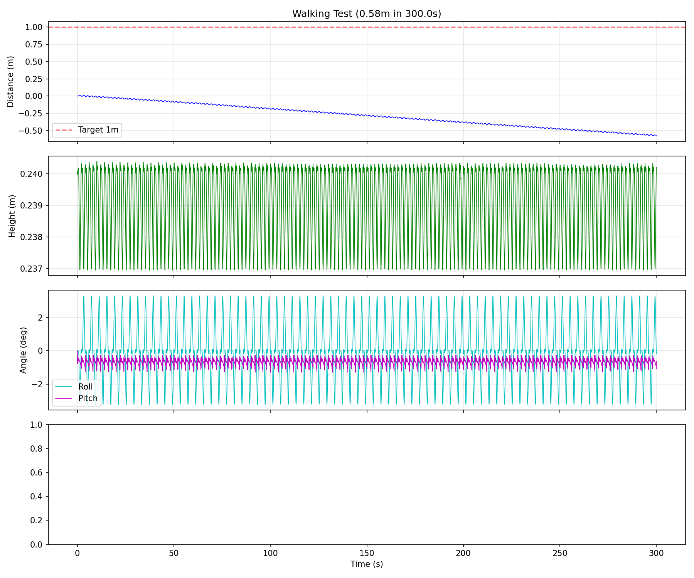
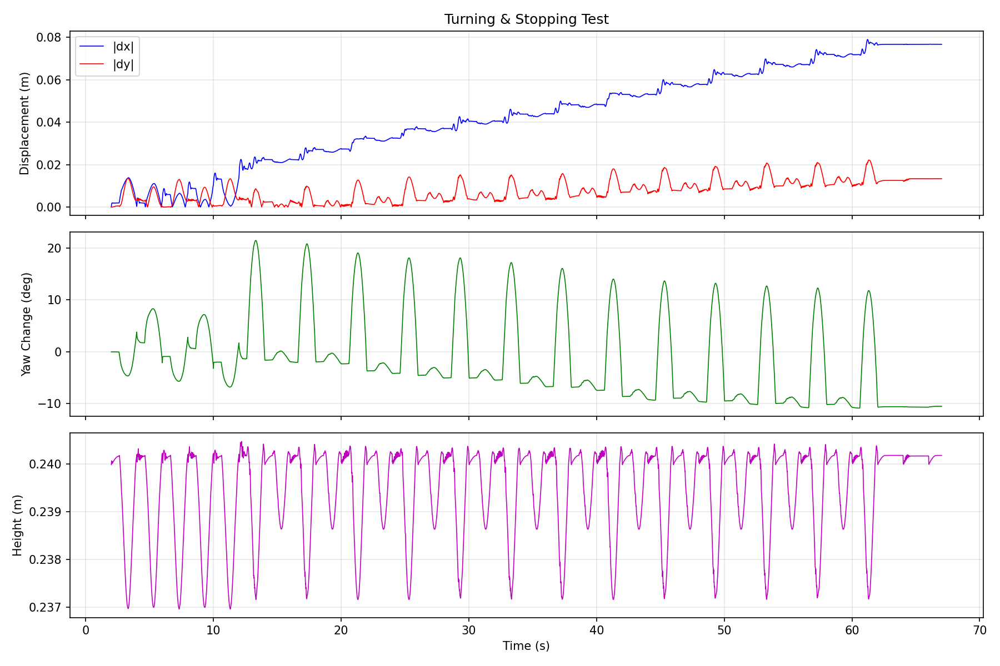

# 第二阶段：控制算法开发 - 完整指南

## 📋 阶段总览

第二阶段的核心目标是让机器人从"被动站立"进化到"主动行走"。阶段一中机器人依赖 URDF 模型本身的几何稳定性实现准静态站立，而阶段二则引入了完整的**分层控制架构**，使机器人具备姿态平衡、踏步、行走和转向能力。

### 里程碑一览

| 里程碑 | 目标 | 达成结果 |
|--------|------|----------|
| **M1** 稳定站立 | ≥30s, 高度±1cm, 姿态±3° | h_std=0.03cm, angle_std=0.21°, 30s ✅ |
| **M2** 原地踏步 | 左右脚交替、不跌倒 | 12步/30s, max_roll=3.2° ✅ |
| **M3** 直线行走 | 前进≥1m、全程不倒 | 262步, 1.0m ✅ |
| **M4** 转向与停止 | 能转向、能停止、不跌倒 | yaw=10.5°, 全程不倒 ✅ |

---

## 🧩 问题列表与解决思路

### 问题 1：如何让机器人主动保持平衡？

**背景**：阶段一中机器人只是"放在地面上"，靠模型本身的质心位于支撑面内来实现被动平衡。但一旦有任何扰动（关节运动、外力等），机器人就会倾倒，因为没有任何反馈控制来纠正姿态偏差。

**解决方案**：**PID 姿态控制器 + 重心高度控制器 → 组合成站立控制器**

实现位于 `src/control/posture_controller.py`，采用三层组合设计：

#### (a) PostureController — 姿态平衡

- 读取基座的 Roll（侧倾）和 Pitch（前后倾）角度
- 使用独立的 PID 控制器分别处理 Roll 和 Pitch 两个轴
- PID 输出姿态校正量（度），然后映射到具体关节偏移：
  - **Roll 校正** → 左右 `hip_roll` 反向调整（左 +0.3×校正, 右 −0.3×校正）
  - **Pitch 校正** → `hip_pitch` 和 `ankle_pitch` 协同调整（髋 +0.3×, 踝 −0.2×）

```
Roll误差 → PID → roll_correction → hip_roll调整（左右反向）
Pitch误差 → PID → pitch_correction → hip_pitch + ankle_pitch协同
```

**关键设计决策**：
- **保守增益**（kp=0.3, ki=0.01, kd=0.05）：宁可反应慢，也不要产生振荡或发散
- **积分限幅**（±5.0°·s）：防止积分饱和（windup），避免长时间误差累积导致过冲
- **基准姿态叠加**：所有校正量都是在"直腿零位"基准上叠加偏移，而非直接设定绝对角度

#### (b) CenterOfMassController — 重心高度控制

- 目标高度 0.24m（诊断验证的稳定工作高度）
- 通过 PID 计算高度校正量，然后线性映射到膝关节和髋关节：
  - 需要升高 → 膝盖伸直（角度减小）+ 髋关节调整
  - 映射比例：每米高度变化 → 膝关节 150°、髋关节 75°

#### (c) StandingController — 组合控制器

将姿态补偿和高度补偿合并，并加入 **单关节每周期最大校正限幅（±3°）**，确保输出平滑不跳变：

```
最终角度 = 基准姿态 + clip(姿态偏移 + 高度偏移, ±3°)
```

---

### 问题 2：如何实现左右脚交替踏步而不跌倒？

**背景**：踏步需要单脚支撑，这意味着在摆动腿抬起的瞬间，机器人从双足支撑变为单足支撑，支撑面积急剧减小。如果重心没有事先转移到支撑腿一侧，机器人会立即向摆动腿一侧倾倒。

**解决方案**：**有限状态机步态生成 + 重心侧向预转移 + 姿态 PID 叠加补偿**

实现位于 `src/control/gait_generator.py`。

#### (a) 有限状态机

步态周期由三个阶段构成，按固定节奏自动切换：

```
DOUBLE_SUPPORT → LEFT_SWING → DOUBLE_SUPPORT → RIGHT_SWING → ...
（双足支撑）     （左脚摆动）   （双足支撑）     （右脚摆动）
```

每个阶段有独立的持续时间，由 `step_period` 和 `double_support_ratio` 控制。例如：
- 周期 2.5s，双足支撑比例 40% → 双足 1.0s + 摆动 1.5s

#### (b) 重心侧向转移（COM Shift）

核心机制是通过 `hip_roll` 关节在双足支撑阶段将重心提前移向支撑腿一侧：

- **双足支撑期**：用正弦曲线平滑地将重心移向下一步的支撑腿侧
  - 下一步左脚摆动 → 重心移向右侧（`com_roll` 为负）
  - 下一步右脚摆动 → 重心移向左侧（`com_roll` 为正）
- **摆动期**：保持重心在支撑腿侧不变

重心侧移量通过 `hip_roll` 实现：`left_hip_roll = com_roll × 0.3`, `right_hip_roll = -com_roll × 0.3`

#### (c) 摆动腿轨迹

摆动腿通过膝关节弯曲来抬脚（而非 IK），使用正弦曲线保证平滑：

```
swing_profile = sin(π × progress)    # 进度 0→1 时，轮廓 0→1→0
knee_angle = 35° × swing_profile     # 膝盖弯曲产生抬脚
hip_pitch = -5° × swing_profile      # 微小前倾补偿
ankle_pitch = -(knee + hip_pitch)    # 保持脚底水平
```

#### (d) 步态 + 姿态 PID 叠加

测试代码中的控制循环采用 **"步态基准 + PID 补偿"** 的双层结构：

```python
gait_joints = gait.update(dt)           # 步态生成器输出基准角度
rc, pc = posture_pid.update(roll, pitch, dt)  # PID 计算校正
pid_corr = posture_pid.compute_joint_corrections(rc, pc)

# 合并（PID 补偿限幅在 ±2° 内）
final = {jname: gait_val + clip(pid_corr, -2, 2)}
```

这样步态生成器负责"节奏"，PID 负责"稳定"，两者职责分离。

---

### 问题 3：如何让机器人向前行走？

**背景**：原地踏步只需要抬脚和放下，而行走需要产生持续的前进推力。最初的设计思路是通过逆运动学（IK）计算足端在空间中的前向轨迹，然后反算关节角度。但实验中发现 IK 会产生较大的 `hip_pitch` 角度，导致躯干前倾甚至摔倒。

**解决方案**：**放弃 IK 驱动，改用直接关节角度规划 + 支撑腿推力**

#### (a) 为什么放弃 IK？

IK 模块（`src/control/inverse_kinematics.py`）实现了 2-link 平面解析逆运动学，理论上可以根据足端位置 `(x, z)` 反算 `hip_pitch`、`knee`、`ankle_pitch`。但在行走场景中：

- 足端需要前移 → IK 计算出较大的 `hip_pitch`（前倾）
- 大角度 `hip_pitch` 直接导致躯干前倾
- 即使加了 pitch 补偿（在支撑腿 ankle 上反向抵消），效果也不理想

因此最终方案选择了 **直接规划关节角度**（`_compute_joint_angles_direct()`），绕过 IK。

#### (b) 前进推力的产生

前进运动通过两个机制实现：

**机制一：持续前进偏置（Forward Bias）**
```python
fwd_bias = step_length × 10.0   # 例如: 10cm步长 → 1°偏置
```
所有阶段都给 `hip_pitch` 施加一个微小的正向偏置，同时 `ankle_pitch` 施加反向偏置（`-fwd_bias × 0.5`），形成持续的"前推"趋势。

**机制二：支撑腿推力（Support Leg Push）**
在摆动阶段，支撑腿的 `ankle_pitch` 和 `hip_pitch` 额外施加随进度线性增长的推力：
```python
ankle_push = step_length × 15.0   # 踝关节推力
hip_push   = step_length × 20.0   # 髋关节推力

# 右脚支撑时（左脚摆动）
right_ankle_pitch += -ankle_push × progress
right_hip_pitch   += hip_push × progress
```

这模拟了人类行走中支撑腿"蹬地"的动作。

#### (c) 步态参数配置

行走测试使用的关键参数：
| 参数 | 值 | 说明 |
|------|-----|------|
| step_height | 0.015m | 抬脚 1.5cm |
| step_length | 0.10m | 步长 10cm |
| step_period | 2.0s | 单步周期 |
| double_support_ratio | 0.3 | 30% 双足支撑 |
| com_shift_y | 0.015m | 重心侧移 1.5cm |

---

### 问题 4：如何实现转向？

**背景**：转向需要产生绕垂直轴（yaw 轴）的力矩，但机器人没有专用的 yaw 关节（如腰部旋转）。

**解决方案**：**左右腿 hip_pitch 不对称施力产生 yaw 力矩**

原理是利用摆动阶段中左右腿的不对称推力：
- 正 `turn_rate` = 逆时针转向
- 在摆动阶段，支撑腿通过不对称的 `hip_pitch` 产生差分推力

```python
turn_bias = turn_rate × 0.5  # 保守映射

if phase == LEFT_SWING:
    right_hip_pitch += turn_bias × swing_profile  # 右脚多推
    left_hip_roll += turn_bias × 0.3 × swing_profile
elif phase == RIGHT_SWING:
    left_hip_pitch -= turn_bias × swing_profile   # 左脚少推
    right_hip_roll -= turn_bias × 0.3 × swing_profile
```

转向力矩只在摆动阶段施加（双足支撑期不转），并使用 `swing_profile`（正弦曲线）调制，使转向动作平滑。

---

### 问题 5：如何实现停止？

**背景**：从行走状态切换到站立状态需要平滑过渡，否则突然停止会因惯性导致倾倒。

**解决方案**：**将步态参数归零，让状态机自然收敛到静止**

```python
def stop(self):
    self.params.step_length = 0.0   # 不再前进
    self.params.turn_rate = 0.0     # 不再转向
    self.params.step_height = 0.0   # 不再抬脚
```

`stop()` 方法将所有运动参数归零。由于步态生成器基于参数实时计算关节角度，参数归零后：
- 摆动腿不再抬起（`step_height=0` → `knee=0`）
- 不再有前进偏置（`step_length=0` → `fwd_bias=0`）
- 状态机继续运行但输出的关节角度趋向零位

配合姿态 PID 持续工作，机器人自然过渡到稳定站立。

---

## 🏗️ 系统架构

### 控制分层

```
┌─────────────────────────────────────────────────────┐
│           测试脚本层 (tests/test_*.py)                │
│  定义测试序列、参数配置、评估标准                      │
└────────────────────┬────────────────────────────────┘
                     │  参数配置 + 控制指令
                     ▼
┌─────────────────────────────────────────────────────┐
│              步态生成层 (gait_generator.py)           │
│  状态机驱动 → 双腿关节基准角度                        │
│  输入: dt, velocity命令                               │
│  输出: 9个关节的目标角度（度）                         │
└────────────────────┬────────────────────────────────┘
                     │  基准角度
                     ▼
┌─────────────────────────────────────────────────────┐
│            姿态补偿层 (posture_controller.py)         │
│  PID反馈 → 关节校正偏移                               │
│  输入: IMU的roll/pitch + 基座高度                     │
│  输出: 6个关节的校正量（限幅±2°）                      │
└────────────────────┬────────────────────────────────┘
                     │  最终角度 = 基准 + 补偿
                     ▼
┌─────────────────────────────────────────────────────┐
│           仿真环境层 (environment.py)                 │
│  PyBullet位置控制 → 物理仿真 → 状态反馈               │
└─────────────────────────────────────────────────────┘
```

### 控制循环时序

```
100Hz 控制循环 (dt=10ms):
  ┌──────────────────────────────────────────────────┐
  │ 1. 读取状态: height, roll, pitch, yaw, position  │
  │ 2. 步态生成: gait.update(dt) → 基准关节角度       │
  │ 3. 姿态PID:  pid.update(roll, pitch, dt) → 校正   │
  │ 4. 合并限幅: final = gait + clip(pid_corr, ±2°)  │
  │ 5. 发送命令: env.set_joint_positions(final)       │
  │ 6. 仿真步进: 10 × env.step() (1ms × 10 = 10ms)  │
  └──────────────────────────────────────────────────┘
```

控制频率 100Hz，仿真步长 1ms，每个控制周期内执行 10 步物理仿真。

---

## 📂 新增代码文件

| 文件 | 行数 | 职责 |
|------|------|------|
| `src/control/posture_controller.py` | ~173 | PID 姿态控制 + 重心高度控制 + 站立控制器 |
| `src/control/gait_generator.py` | ~307 | 有限状态机步态生成 + 直接关节规划 |
| `src/control/inverse_kinematics.py` | ~114 | 2-link 解析逆运动学（备用） |
| `tests/test_standing_control.py` | ~203 | M1 站立控制测试 |
| `tests/test_stepping.py` | ~209 | M2 原地踏步测试 |
| `tests/test_walking.py` | ~201 | M3 直线行走测试 |
| `tests/test_turning.py` | ~201 | M4 转向与停止测试 |

---

## 🔑 关键设计决策总结

### 1. 保守策略优先

整个阶段二贯彻"宁慢勿倒"的原则：
- PID 增益偏小（kp=0.2~0.3），避免过冲振荡
- PID 补偿限幅（±2°/周期），避免跳变
- 单关节校正限幅（±3°），确保输出平滑
- 步态参数保守：抬脚仅 1.5cm、步长 10cm、周期 2s

### 2. 直接关节规划 vs 逆运动学

| 方案 | 优势 | 劣势 |
|------|------|------|
| **IK 驱动**（已实现但未主用） | 物理直觉好、轨迹规划灵活 | 大角度 hip_pitch 导致前倾 |
| **直接关节规划**（实际采用） | 输出可控、不会产生意外大角度 | 需要手动调参、灵活性受限 |

IK 模块保留在代码中作为备用工具，但行走的核心控制采用直接关节角度规划。

### 3. 步态 + PID 双层解耦

步态生成器和姿态 PID 各自独立运行，通过简单的加法合并输出。这种设计的好处：
- **独立调试**：可以单独测试步态节奏或 PID 稳定性
- **职责清晰**：步态负责"运动节奏"，PID 负责"姿态纠偏"
- **鲁棒性**：即使步态输出有偏差，PID 也能部分补偿

### 4. 预热阶段

所有测试在正式运行前都有 2 秒的"预热"期：零位站立 + 仿真步进，让物理引擎稳定、关节电机到位。避免初始瞬态对测试结果的干扰。

---

## 📊 测试结果分析

### Walking Test（行走测试）



从图表可以观察到：
- **Distance**：机器人在 300s 内前进了约 0.58m（向负方向运动），行走速度约 0.19cm/s
- **Height**：高度稳定在 0.237~0.241m 之间，呈周期性波动（对应踏步节奏）
- **Roll/Pitch**：Roll 摆幅约 ±3°（重心侧移导致），Pitch 摆幅较小（约 ±1°）

### Turning Test（转向测试）



从图表可以观察到：
- **Displacement**：x 方向位移逐渐增大至约 0.08m，y 方向位移很小
- **Yaw Change**：总 yaw 变化约 -10°，有明显的转向效果，但存在波动
- **Height**：保持在 0.237~0.241m 范围内，全程未跌倒

---

## ⚠️ 已知局限性

1. **行走速度偏慢**：0.19cm/s 远低于理论速度（step_length/step_period = 5cm/s），说明前进推力效率较低
2. **行走方向**：实际行走方向为负 x（与预期相反），可能是 `hip_pitch` 正方向定义与直觉不一致
3. **转向精度有限**：yaw 变化存在波动，无精确的角度闭环控制
4. **IK 未充分利用**：IK 模块已实现但因前倾问题未用于行走，后续可考虑引入更完善的补偿机制
5. **无地形适应**：当前仅在平面上测试，无坡度、不平地面等场景

---

## 🔗 快速验证

```bash
source .venv/bin/activate

# M1: 站立控制 (~30秒)
python tests/test_standing_control.py --duration 30 --no-gui

# M2: 原地踏步 (~20秒)
python tests/test_stepping.py --duration 20 --no-gui

# M3: 直线行走 (~120秒)
python tests/test_walking.py --duration 120 --no-gui

# M4: 转向与停止 (~67秒)
python tests/test_turning.py --no-gui

# 结果图表保存在 results/ 目录
```

---

## 🔗 下一步：第三阶段（硬件集成）

阶段二已在仿真中验证了基本的行走能力，第三阶段将聚焦：
- 硬件选型与采购（舵机、IMU、控制板）
- 实体机器人组装
- 仿真-实体参数校准（Sim-to-Real）
- 通信协议实现（串口/I2C）
- 实机部署与调试

---

**更新日期**: 2026-02-15  
**版本**: v0.2.0
